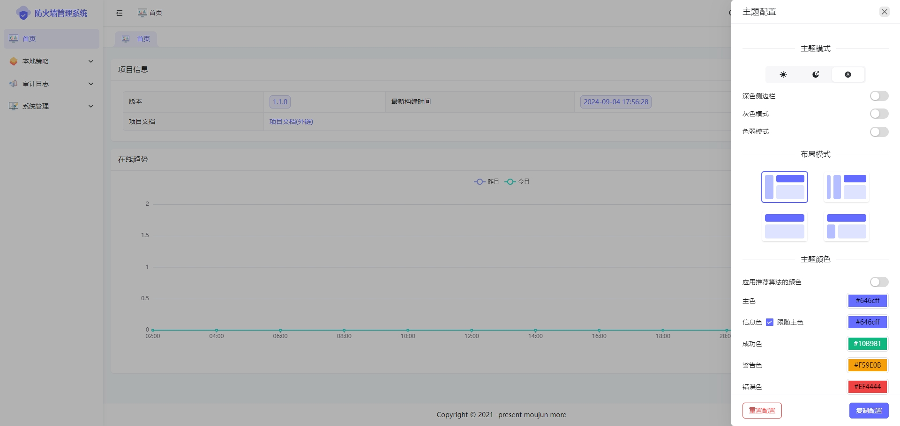
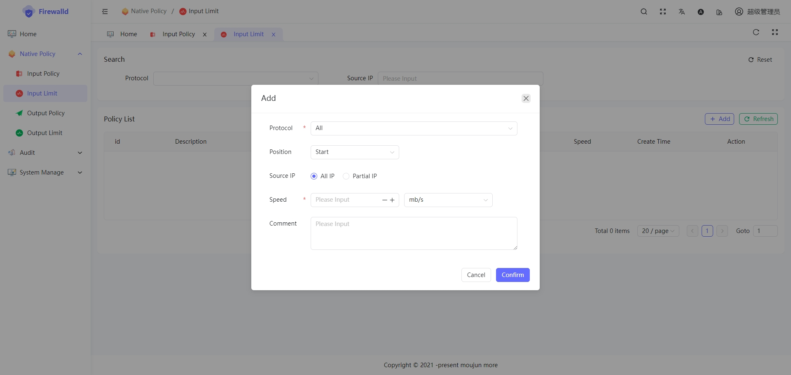
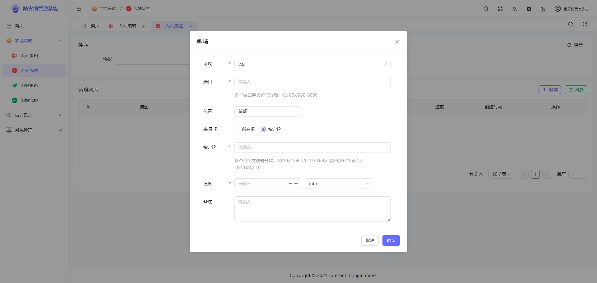
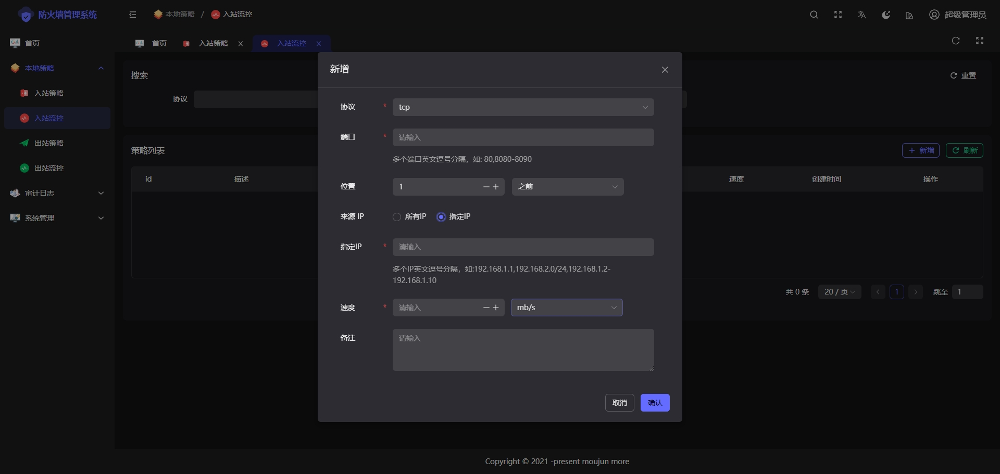

# 简介

`web-firewall`基于golang+vue3 开发的Web Linux防火墙，前端使用`SoybeanAdmin`框架，后端使用`goframe2`，数据库支持 `sqlite3(默认)`/`postgresql` ，它可以在Linux系统中基于`nfatables`用于替代`firewalld`工具。

Gitee Star：[](https://gitee.com/moujun/web-firewall)

Github Star：[](https://github.com/moreKing/web-firewall)

Github Forks：[](https://github.com/moreKing/web-firewall)

该防火墙可以提供以下功能


### 功能设计

   - ✅ 本地策略
     - ✅ 出站策略 output链
     - ✅ 出站流控 output链
     - ✅ 入站策略 input链
     - ✅ 入站流控 input链
   - ☐ 地址转换（NAT）
     - ☐ DNAT prerouting链
     - ☐ SNAT postrouting
   - ☐ 转发策略（作为网关时）
     - ☐ 转发策略forward 链
     - ☐ 流量控制 forward 链

   - ☐ ip黑名单 prerouting链
   - 审计
     - ✅ 登录日志
     - ✅ 配置日志
     - ☐ webSSH日志
   - WebShell
     - ✅ webshell 支持rzsz，支持自动转码gbk
     - ☐ 文件上传下载
     - ☐ 文本在线编辑
   - ☐ 首页
   - ✅ 系统设置
     - ✅ 本地密码
     - ✅ 会话配置
     - ✅ 邮件配置
     - ✅ 短信配置
     - ✅ 登录设置

### 安装

本项目提供一个已经打包编译好的项目，用户仅需自己[下载](https://gitee.com/moujun/web-firewall/releases/download/v1.1.0/v1.1.0.zip)本项目解压后，执行 里面的`install.sh`文件即可，如果自己编译项目请根据前后端代码自行进行打包即可

```shell
unzip v1.1.0.zip
cd v1.1.0
bash install.sh

# 查看服务是否正常运行
systemctl status web-firewalld

# 建议停用firewalld服务
systemctl disable  firewalld
systemctl stop  firewalld
```

访问地址：http://ip:8000

默认账号密码：admin/admin


### 项目截图












